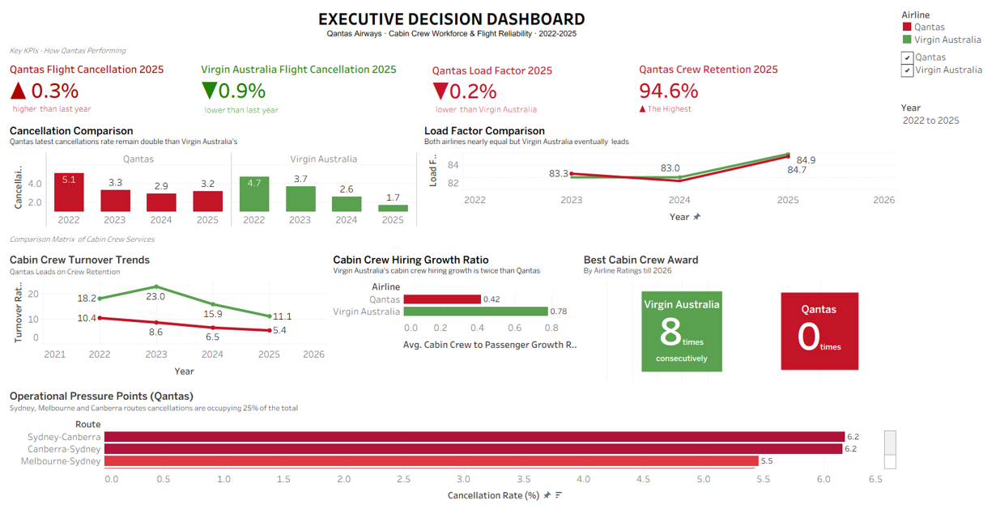
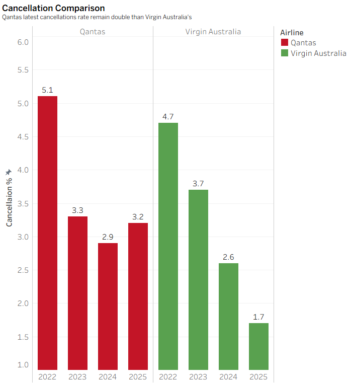
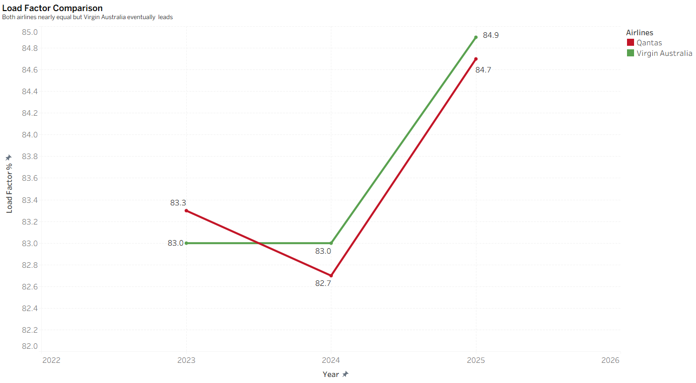
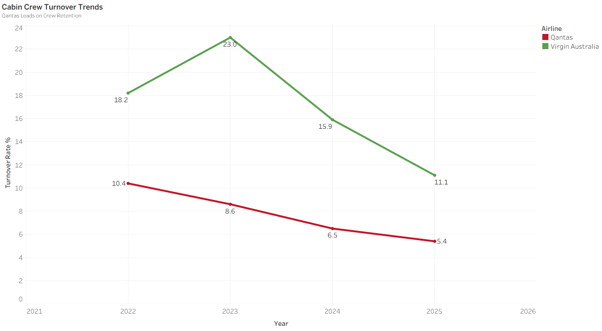
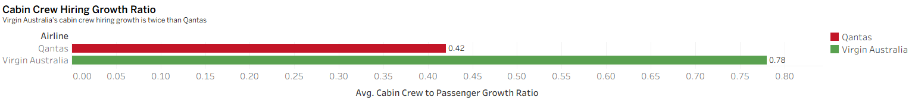
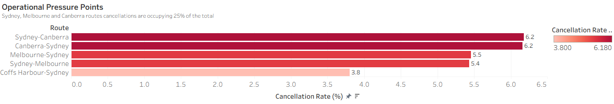

# Qantas Cabin Crew Workforce & Flight Reliability Dashboard

> **Business Intelligence Portfolio Project**
> An executive decision-support dashboard developed in Tableau to examine flight reliability, workforce capacity, operational efficiency, and route-level cancellation pressure across Qantas and Virgin Australia.

<p align="center">
  
</p>

<p align="center">
  <strong>Business Intelligence</strong> •
  <strong>Tableau</strong> •
  <strong>Executive Dashboard</strong> •
  <strong>Workforce Analytics</strong> •
  <strong>Aviation Operations</strong>
</p>

---

## Executive Summary

This project converts publicly available aviation, workforce, financial, and industry data into an executive decision-support dashboard covering **2022–2025**.

Key findings include:

- Qantas recorded a **3.2% domestic flight cancellation rate in 2025**, compared with **1.7% for Virgin Australia**.
- Qantas achieved stronger workforce retention, with a **5.4% turnover rate** and **94.6% retention** in 2025.
- Virgin Australia recorded a higher average cabin-crew-to-passenger growth ratio: **0.78**, compared with **0.42 for Qantas**.
- Virgin Australia slightly led domestic load factor in 2025, at **84.9%**, compared with **84.7% for Qantas**.
- Sydney–Canberra, Canberra–Sydney, Melbourne–Sydney, and Sydney–Melbourne were the most prominent route-level cancellation pressure points in the analysis.

The dashboard reveals an important management tension: **Qantas retained its workforce more effectively, but this strength did not translate into lower cancellation rates or a higher load factor than its competitor.**

---

## Project Deliverables

| Deliverable | Description | Access |
|---|---|---|
| 📊 Tableau Dashboard | Packaged interactive Tableau workbook | [Open dashboard file](dashboard/qantas-executive-dashboard.twbx) |
| 📄 Executive Report | Full project commentary, analysis, limitations, and references | [Read the report](report/executive-dashboard-report.pdf) |
| 📁 Processed Data | Analytical datasets prepared for dashboard development | [Browse processed data](data/processed/) |
| 📚 Data Sources | External data sources and source-use policy | [View data sources](data/sources.md) |

> **Viewing the dashboard:** The packaged `.twbx` workbook can be opened in Tableau Desktop or Tableau Reader. The dashboard screenshots below provide a complete visual walkthrough for visitors who do not have Tableau installed.

---

## Business Problem

Flight cancellations affect customer confidence, operational efficiency, airline reputation, and financial performance.

Qantas improved its domestic cancellation rate from **5.1% in 2022** to **3.2% in 2025**. However, Virgin Australia improved from **4.7% to 1.7%** over the same period, leaving Qantas with a persistent competitive reliability gap.

At the same time, Qantas reported stronger cabin crew retention. Its turnover rate declined from **10.4% in 2022** to **5.4% in 2025**, while Virgin Australia's declined from **18.2% to 11.1%**.

This creates the central decision problem:

> **Why does Qantas continue to experience higher cancellation rates despite stronger workforce retention?**

The dashboard examines this question through workforce capacity, load factor, service recognition, and route-level cancellation analysis. It is intended to support executive judgement rather than establish a direct causal relationship between cabin crew metrics and flight cancellations.

---

## Executive Decision Questions

The dashboard was designed around six executive-level questions:

1. How does Qantas compare with Virgin Australia in domestic flight cancellation performance?
2. Has cabin crew retention improved over time?
3. Is workforce growth keeping pace with passenger growth?
4. How competitive is Qantas in terms of domestic load factor?
5. Does external cabin crew recognition align with operational performance?
6. Which Qantas domestic routes show the greatest cancellation pressure?

---

## Analytical Approach

The dashboard follows a structured decision pathway:

1. **Establish the performance gap** using cancellation rates and load factor.
2. **Assess workforce stability** through turnover and retention trends.
3. **Evaluate workforce capacity** using the cabin-crew-to-passenger growth ratio.
4. **Add service-quality context** through external cabin crew recognition.
5. **Translate strategy into action** through route-level cancellation analysis.

This sequence moves the analysis from organisation-wide performance to specific operational priorities.

---

## Dashboard Highlights


### Competitive Position

The cancellation comparison shows that both airlines improved between 2022 and 2025, but Virgin Australia improved more rapidly.

<p align="center">
  
</p>

**Key insight:** Qantas's 2025 cancellation rate was **3.2%**, compared with **1.7% for Virgin Australia**. The gap widened after Qantas's cancellation rate increased from 2.9% in 2024.

---

### Operational Efficiency

Domestic load factor remained close for both airlines throughout the comparison period.

<p align="center">
  
</p>

**Key insight:** In 2025, Virgin Australia recorded an **84.9%** load factor, narrowly ahead of Qantas at **84.7%**.

---

### Workforce Stability

Cabin crew turnover provides a proxy for workforce stability and retention.

<p align="center">
  
</p>

**Key insight:** Qantas maintained substantially lower turnover throughout the period. Its turnover rate fell to **5.4% in 2025**, compared with **11.1% for Virgin Australia**.

---

### Workforce Capacity

The cabin-crew-to-passenger growth ratio compares workforce growth with passenger growth.

<p align="center">
  
</p>

**Key insight:** Virgin Australia's average ratio was **0.78**, compared with **0.42 for Qantas**, indicating that its workforce growth aligned more closely with passenger growth under the proxy used in this project.

---

### Operational Pressure Points

The route-level analysis identifies where Qantas experienced its highest cancellation rates.

<p align="center">
  
</p>

**Key insight:** Canberra-Sydney, Melbourne-Sydney and vice versa routes account for approximately 25% of Qantas's total 
domestic cancellations. 

---

## Key Performance Indicators

The dashboard monitors:

| KPI | Purpose |
|---|---|
| Flight cancellation rate | Measures operational reliability |
| Load factor | Assesses capacity utilisation and operating efficiency |
| Cabin crew turnover rate | Indicates workforce stability |
| Cabin crew retention rate | Shows the proportion of the workforce retained |
| Cabin-crew-to-passenger growth ratio | Compares workforce growth with passenger growth |
| Cabin crew service recognition | Adds an external service-quality benchmark |
| Route-level cancellation rate | Identifies operational pressure points |

---

## Dashboard Features

- Executive KPI cards
- Airline and year filters
- Comparative trend analysis
- Workforce stability analysis
- Workforce growth assessment
- Domestic load factor comparison
- External service-recognition benchmarking
- Route-level cancellation analysis
- Executive-focused visual narrative
- Packaged Tableau workbook for offline exploration

---

## Tools and Technologies

| Category | Technology |
|---|---|
| Business Intelligence | Tableau |
| Dashboard Development | Tableau |
| Data Preparation | Microsoft Excel |
| Data Analysis | Tableau and Excel |
| Documentation | Microsoft Word |
| Version Control and Portfolio Hosting | Git and GitHub |

---

## Skills Demonstrated

### Business Intelligence

- Executive dashboard development
- KPI selection and design
- Decision-support reporting
- Dashboard information architecture
- Interactive filtering

### Data Analytics

- Multi-source data integration
- Data cleaning and restructuring
- Comparative analysis
- Trend analysis
- Workforce and operational analytics
- Ratio development and interpretation

### Data Visualisation

- Executive data storytelling
- Comparative chart design
- KPI card development
- Visual hierarchy
- Insight-focused annotation

### Business Analysis

- Problem framing
- Executive decision-question development
- Competitive benchmarking
- Operational prioritisation
- Limitation and assumption assessment

---

## Data Sources

The analysis integrates publicly available information from:

- Bureau of Infrastructure, Transport and Regional Economics
- Australian Competition and Consumer Commission
- Qantas annual reports
- Qantas investor presentations
- Qantas sustainability reporting
- Virgin Australia sustainability reporting
- AirlineRatings.com
- Statista

Complete source documentation is available in [`data/sources.md`](data/sources.md).

---

## Assumptions and Limitations

This project should be interpreted as an executive exploratory analysis.

- Direct annual cabin crew headcount was not consistently available. Broader workforce figures were used as a proportional proxy when constructing the workforce-growth comparison.
- The dashboard does not establish that cabin crew capacity directly caused flight cancellations.
- Flight cancellations can also result from weather, engineering issues, air traffic control restrictions, airport disruptions, security events, and other operational factors.
- Load factor analysis is limited to the domestic data used in the project.
- External service recognition is presented as contextual benchmarking rather than a complete measure of service quality.
- The route analysis identifies high cancellation rates but does not independently explain the causes of those cancellations.

Future development could incorporate monthly or quarterly data, on-time performance, passenger satisfaction, aircraft and engineering disruptions, weather, and near-real-time BITRE data integration.

---

## Ethical and Privacy Considerations

All information used in the project was obtained from publicly available sources.

No personal, confidential, or individually identifiable employee or passenger data was used. The dashboard evaluates organisation-level operational and workforce patterns and is not intended to assess individual employees.

Original corporate reports are not redistributed in this repository. The project includes processed analytical data, source documentation, dashboard files, screenshots, and the author's report.

---

## Repository Structure

```text
qantas-cabin-crew-workforce-analysis/
│
├── LICENSE
├── README.md
│
├── dashboard/
│   └── qantas-executive-dashboard.twbx
│
├── data/
│   ├── sources.md
│   └── processed/
│       ├── all-sources.csv
│       ├── dashboard-data.xlsx
│       └── otp-time-series-data.xlsx
│
├── images/
│   ├── cabin-crew-hiring-growth-ratio.png
│   ├── competitive-position.png
│   ├── dashboard-overview.png
│   ├── operational-pressure-points.png
│   ├── otp-load-factor.png
│   └── workforce-stability.png
│
└── report/
    └── executive-dashboard-report.pdf
```

---

## Author

**Md Soad Solaiman**

---

## License

This project is licensed under the [MIT License](LICENSE).
Third-party datasets, reports, trademarks, and corporate materials remain subject to the ownership, licensing, and usage policies of their respective publishers.
